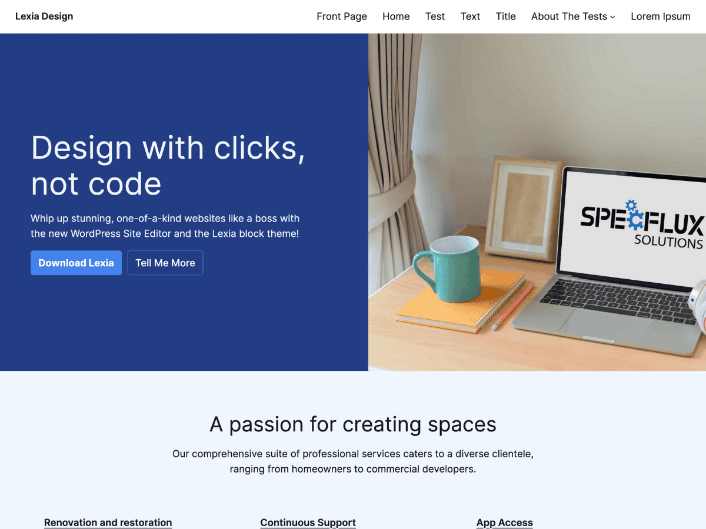

# LexiaDesign

A WordPress Full Site Editing block theme that combines stunning visuals with conversion-focused design.

## Features

- **75+ patterns** across 15 categories — heroes, CTAs, testimonials, pricing, and more
- **6 style variations** — Emerald, Fuchsia, Indigo, Lime, Orange, Rose
- **Fluid design system** — responsive typography and spacing using `clamp()`
- **3 font families** — Inter, DM Sans, Source Serif 4 (all variable fonts)
- **21-color palette** — 9 base shades + 9 brand colors + accent + transparent
- **15 block styles** — outline/ghost/pill buttons, rounded/circle images, blur groups, and more
- **6 full-page layouts** — Home, About, Blog, Pricing, Features, Download
- **8 templates** including no-title and featured image variants
- Fully customizable with WordPress Global Styles
- Translation-ready with RTL support

## Requirements

- WordPress 6.6+
- PHP 8.0+
- Tested up to WordPress 6.7

## Installation

1. Download the theme from the [WordPress Theme Directory](https://wordpress.org/themes/lexiadesign/) or from [Releases](https://github.com/specflux/lexiadesign/releases)
2. In your WordPress admin, go to **Appearance → Themes → Add New → Upload Theme**
3. Upload the zip file and activate

## License

GNU General Public License v2 or later — see [LICENSE](http://www.gnu.org/licenses/gpl-2.0.html).

### Third-party resources

**Inter Font** — Copyright 2020 The Inter Project Authors — [SIL Open Font License 1.1](https://opensource.org/licenses/OFL-1.1) — [Source](https://github.com/rsms/inter)

**Images** — Created by Specflux Solutions, released under [CC0 License](https://creativecommons.org/publicdomain/zero/1.0/).
